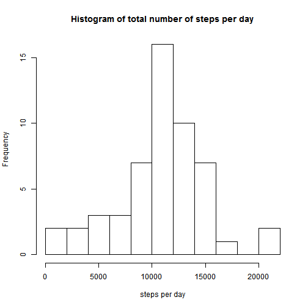
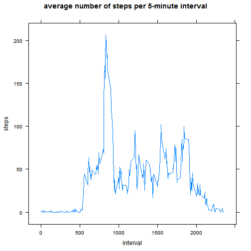
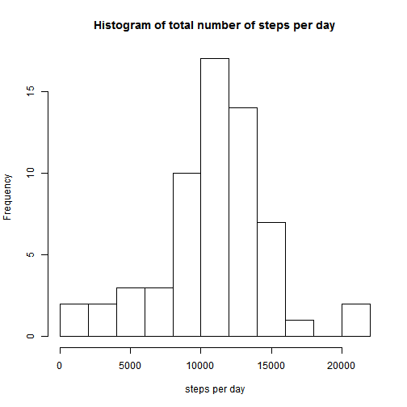
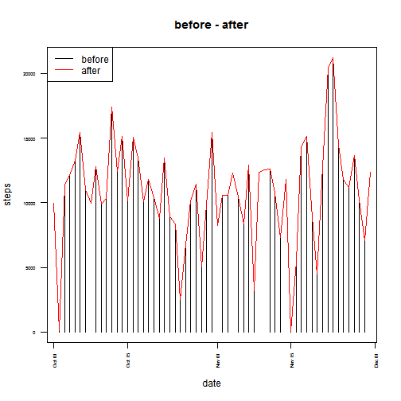
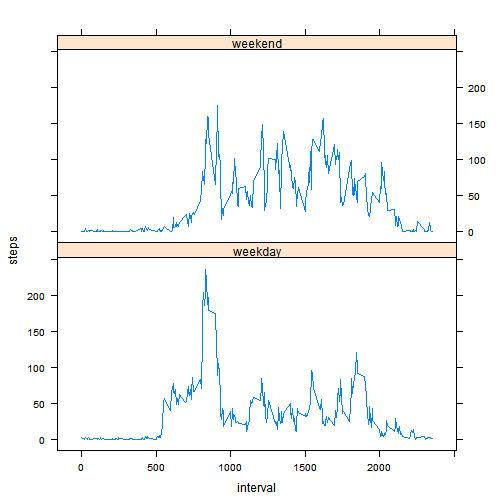

---
output:
  html_document:
    self_contained: no
---
# Reproducible Research: Peer Assessment 1


## Loading and preprocessing the data

Show any code that is needed to  
1. Load the data (i.e. read.csv())  

```r
load_data <- function(base_dir) {
    full_name <- file.path(base_dir, "activity.zip")
    activity_file <- file.path(base_dir, "activity.csv")
    if(!file.exists(activity_file)) {
        unzip(full_name, exdir = base_dir)
    }
    activity <- read.csv(activity_file)
    return(activity)
}
activity <- load_data(".")
```

2. Process/transform the data (if necessary) into a format suitable for your  
analysis


```r
prepare_data <- function(df) {
    df$date_p <- strptime(df$date, "%Y-%m-%d")
    df$weekday <- factor(ifelse(df$date_p$wday %in% c(6,0), 
                                "weekend", "weekday"))
    df$date_d <- as.Date(df$date)
    return(df)
}
activity <- prepare_data(activity)
summary(activity)
```

```
##      steps               date          interval   
##  Min.   :  0.0   2012-10-01:  288   Min.   :   0  
##  1st Qu.:  0.0   2012-10-02:  288   1st Qu.: 589  
##  Median :  0.0   2012-10-03:  288   Median :1178  
##  Mean   : 37.4   2012-10-04:  288   Mean   :1178  
##  3rd Qu.: 12.0   2012-10-05:  288   3rd Qu.:1766  
##  Max.   :806.0   2012-10-06:  288   Max.   :2355  
##  NA's   :2304    (Other)   :15840                 
##      date_p                       weekday          date_d          
##  Min.   :2012-10-01 00:00:00   weekday:12960   Min.   :2012-10-01  
##  1st Qu.:2012-10-16 00:00:00   weekend: 4608   1st Qu.:2012-10-16  
##  Median :2012-10-31 00:00:00                   Median :2012-10-31  
##  Mean   :2012-10-30 23:32:27                   Mean   :2012-10-31  
##  3rd Qu.:2012-11-15 00:00:00                   3rd Qu.:2012-11-15  
##  Max.   :2012-11-30 00:00:00                   Max.   :2012-11-30  
## 
```


## What is mean total number of steps taken per day?

For this part of the assignment, you can ignore the missing values in the dataset.

```r
activity_nona <- na.omit(activity)
activity_per_day <- aggregate(steps ~ date_d, data=activity_nona, FUN=sum)

mean_steps_per_day <- mean(activity_per_day$steps)
median_steps_per_day <- median(activity_per_day$steps)
```

1. Make a histogram of the total number of steps taken each day

```r
hist(activity_per_day$steps, breaks=10, 
     xlab="steps per day", 
     main="Histogram of total number of steps per day")
```

 


2. Calculate and report the mean and median total number of steps taken per day  
   - The mean total number of steps taken per day is:   10766.  
   - The median total number of steps taken per day is: 10765.


## What is the average daily activity pattern?

1. Make a time series plot (i.e. type = "l") of the 5-minute interval (x-axis)
and the average number of steps taken, averaged across all days (y-axis)

```r
per_interval <- aggregate(steps~interval, data=activity, FUN=mean)

library(lattice)
xyplot(steps~interval, data=per_interval, type="l", 
       main="average number of steps per 5-minute interval")
```

 


2. Which 5-minute interval, on average across all the days in the dataset,
contains the maximum number of steps?

```r
max_interval <- per_interval[per_interval$steps == max(per_interval$steps), "interval"]
hour <- as.integer(max_interval/100)
minutes <- max_interval %% 100
```
Its the interval from: 08:35 to: 08:40


## Imputing missing values


Note that there are a number of days/intervals where there are missing values
(coded as NA). The presence of missing days may introduce bias into some
calculations or summaries of the data.

1. Calculate and report the total number of missing values in the dataset
(i.e. the total number of rows with NAs)

```r
number_of_na <- sum(is.na(activity$steps))
```
There are 2304 NAS in the activity dataset.


2. Devise a strategy for filling in all of the missing values in the dataset. The
strategy does not need to be sophisticated. For example, you could use
the mean/median for that day, or the mean for that 5-minute interval, etc.

I am trying to be clever, hahaha...:
impute the average steps on the same interval on the same weekday for the missing steps


3. Create a new dataset that is equal to the original dataset but with the
missing data filled in.

```r
activity_new <- activity
piwd <- aggregate(steps ~ interval+date_p$wday, data=activity_nona, FUN=mean)
names(piwd)[2] <- "wday"
for(i in 1:nrow(activity_new)) {
    if(is.na(activity_new[i,"steps"])) {
        activity_new[i,"steps"] <- 
            piwd[piwd$interval == activity_new[i,"interval"] & 
                     piwd$wday == activity_new[i,"date_p"]$wday, "steps"]
    }
}

summary(activity_new)
```

```
##      steps               date          interval   
##  Min.   :  0.0   2012-10-01:  288   Min.   :   0  
##  1st Qu.:  0.0   2012-10-02:  288   1st Qu.: 589  
##  Median :  0.0   2012-10-03:  288   Median :1178  
##  Mean   : 37.6   2012-10-04:  288   Mean   :1178  
##  3rd Qu.: 19.0   2012-10-05:  288   3rd Qu.:1766  
##  Max.   :806.0   2012-10-06:  288   Max.   :2355  
##                  (Other)   :15840                 
##      date_p                       weekday          date_d          
##  Min.   :2012-10-01 00:00:00   weekday:12960   Min.   :2012-10-01  
##  1st Qu.:2012-10-16 00:00:00   weekend: 4608   1st Qu.:2012-10-16  
##  Median :2012-10-31 00:00:00                   Median :2012-10-31  
##  Mean   :2012-10-30 23:32:27                   Mean   :2012-10-31  
##  3rd Qu.:2012-11-15 00:00:00                   3rd Qu.:2012-11-15  
##  Max.   :2012-11-30 00:00:00                   Max.   :2012-11-30  
## 
```

4. Make a histogram of the total number of steps taken each day and Calculate
and report the mean and median total number of steps taken per day. Do
these values differ from the estimates from the first part of the assignment?

```r
activity_per_day_new <- aggregate(steps ~ date_d, data=activity_new, FUN=sum)

mean_steps_per_day_new <- mean(activity_per_day_new$steps)
median_steps_per_day_new <- median(activity_per_day_new$steps)

hist(activity_per_day_new$steps, breaks=10, 
     xlab="steps per day", 
     main="Histogram of total number of steps per day")
```

 

- The mean total number of steps taken per day is:   10821 compared to 10766 before imputing missing data.  
- The median total number of steps taken per day is: 11015 compared to 10765 before imputing missing data.


What is the impact of imputing missing data on the estimates of the total
daily number of steps?

The total number of daily steps changes from 570608 to 660094 after imputing missing data.

Lets see, what that difference looks like in a plot of the total steps per day


```r
plot(activity_per_day$date_d, activity_per_day$steps, type="h", 
     main="before - after", xlab="date", ylab="steps",las=2, cex.axis=0.5)
lines(activity_per_day_new$date_d, activity_per_day_new$steps, col="red")
legend("topleft", legend=c("before","after"), col=c("black","red"), lty=1)
```

 


The imputation of missing values is visible as the red line has values also where the black bars are missing. The imputation does not fix the issue with the days where the values for almost all intervals are zero.


## Are there differences in activity patterns between weekdays and weekends?

1. Create a new factor variable in the dataset with two levels – “weekday”
and “weekend” indicating whether a given date is a weekday or weekend
day.

This was already done in the prepare_data function above.

2. Make a panel plot containing a time series plot (i.e. type = "l") of the
5-minute interval (x-axis) and the average number of steps taken, averaged
across all weekday days or weekend days (y-axis). The plot should look
something like the following, which was creating using simulated data:

First we have to aggregate by interval and weekday/weekend:

```r
perwd_new <- aggregate(steps~weekday+interval, data=activity_new, mean)
```

This gives the plot:

```r
 xyplot(steps~interval|weekday, data=perwd_new, type="l",layout=c(1,2))
```

 

From this plot two main differences can be detected:  
1. On weekdays the person makes much more steps in the early morning  
2. On weekends the person overall makes more steps but the movement is more evenly distributed across the day.

